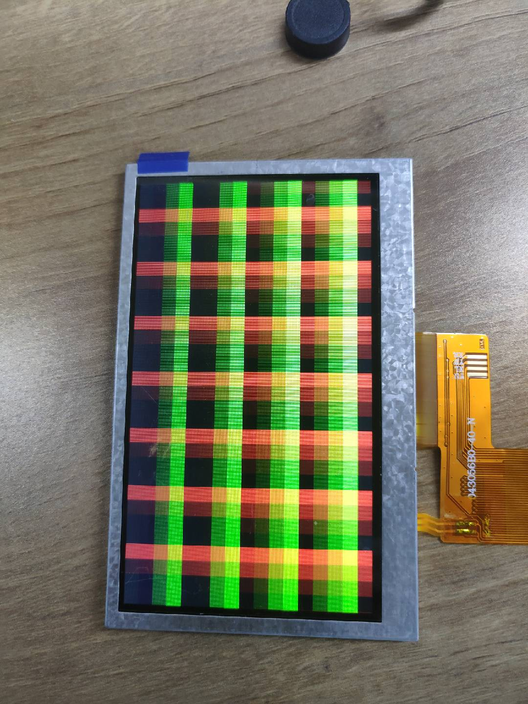
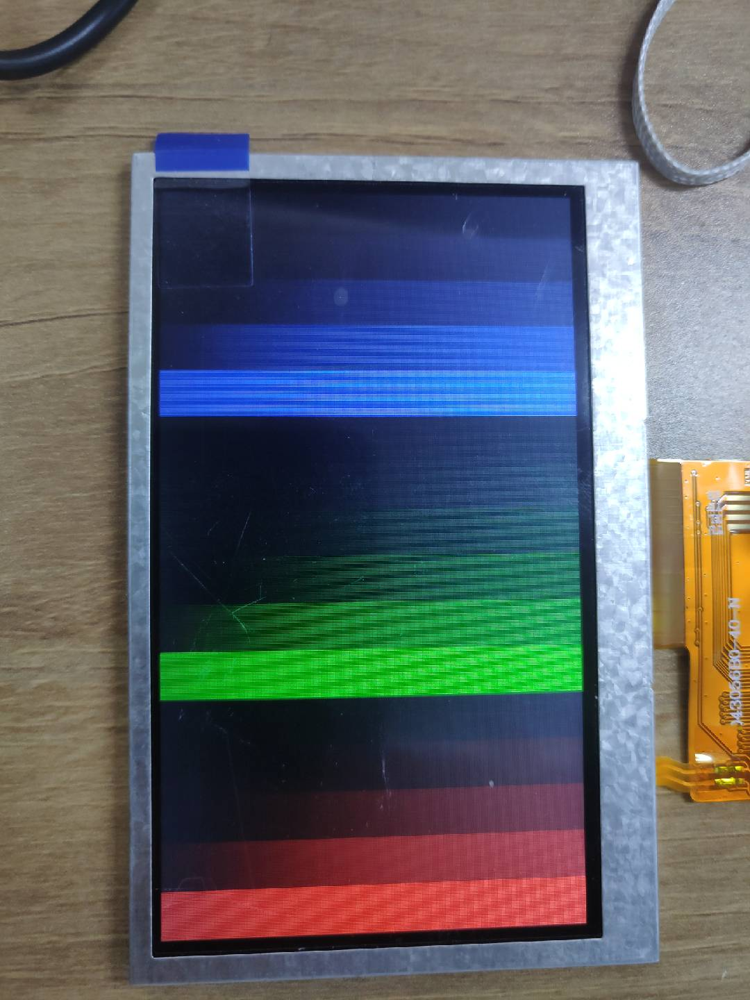
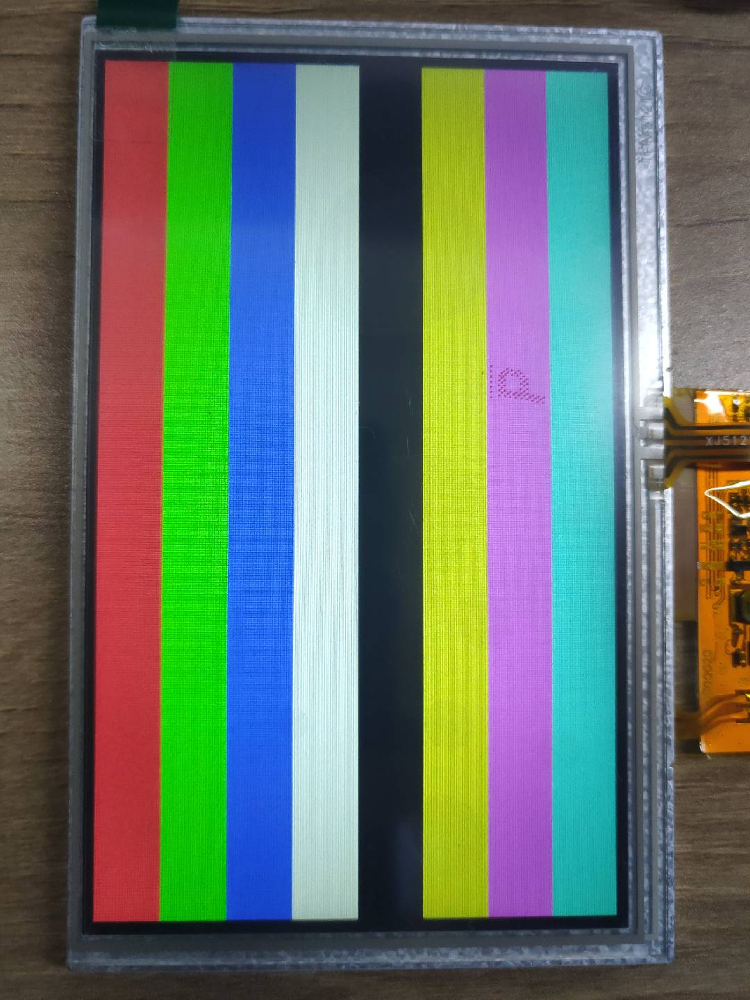

# TangPrimer-20K-example

---

- IDE 基础使用步骤:[点我](https://wiki.sipeed.com/hardware/zh/tang/tang-primer-20k/examples/led.html)
- IDE Instructions:[Click me](https://wiki.sipeed.com/hardware/en/tang/tang-primer-20k/examples/led.html)

---

- [TangPrimer-20K-example](#tangprimer-20k-example)
  - [Note](#note)
    - [Error code:RP2017](#error-coderp2017)
  - [Examples](#examples)
    - [Lite-bottom\_test\_project](#lite-bottom_test_project)
    - [DDR-Test](#ddr-test)
    - [SPI\_lcd](#spi_lcd)
    - [RGB\_lcd](#rgb_lcd)
    - [Cam2lcd](#cam2lcd)
    - [Micarray](#micarray)
    - [rocket](#rocket)
    - [WS2812](#ws2812)
    - [USB](#usb)
    - [UART](#uart)
    - [PT8211](#pt8211)
  - [Tang Primer 20K Dock pin constrain](#tang-primer-20k-dock-pin-constrain)
    - [Clk pin](#clk-pin)
    - [Reset pin](#reset-pin)
    - [RGB LCD](#rgb-lcd)
    - [Camera](#camera)
    - [USB](#usb-1)
    - [Ethernet](#ethernet)
    - [DDR](#ddr)
    - [SPI LCD](#spi-lcd)
    - [UART](#uart-1)
    - [SD card/SDIO](#sd-cardsdio)
    - [Audio DAC](#audio-dac)

## Note

### Error code:RP2017

When you meet error code `PR2017`, just enable corresponding IO as regular IO.

Click `Project` in top menu bar and choose `Configuration`, then enable the corresponding Dual Purpose Pin to deal with this error.

## Examples

### [Lite-bottom_test_project](./Lite-bottom_test_project/test_board/README.md)

This is the test project which is used for testing Lite-bottom and core board(Factory test).
Including the DDR-Test project and another demo containing all other usable IO blink.

### [DDR-Test](./DDR-test/LicheeTang20K_DDR_Test/README.md)

Thanks [ZiyangYE](https://github.com/ZiyangYE) providing this example.
Using serial-communication with 115200 baudrates to shows result.

### SPI_lcd

This is an example driving 1.14 inch spi screen.

### [RGB_lcd](./RGB_lcd/readme.md)

Screen datasheet: [Click me](https://dl.sipeed.com/shareURL/TANG/Nano%209K/6_Chip_Manual/EN/LCD_Datasheet)

Cross colorbar on the screen.

| 480x272_4.3inch_lcd                         | 800x480_5inch_lcd                           |
| ------------------------------------------- | ------------------------------------------- |
|  |  |

Colorbar on screen

| rgb_lcd_4.3inch_colorbar                                    | rgb_lcd_5inch_colorbar                                  |
| ----------------------------------------------------------- | ------------------------------------------------------- |
|  |  |

### Cam2lcd

There are 4 projects, their name rules are as followings:

| Folder name        | Camera | Screen resolution | Frame storge mode |
| ------------------ | ------ | ----------------- | ----------------- |
| OV5640_LCD480_DDR3 | OV5640 | 480x272           | DDR3              |
| OV5640_LCD800_DDR3 | OV5640 | 800x480           | DDR3              |
| OV5640_LCD480_FIFO | OV5640 | 480x272           | FIFO              |
| OV5640_LCD800_FIFO | OV5640 | 800x480           | FIFO              |

These are only for testing, and if you want better results, you need program on yourself.

After burning the .fs bitstream into fpga, press `S0` button to reset fpga chip to get right display.

### Micarray

There is demo for micarray board.

### [rocket](./rocket/README.md)

This runs a `rv32ic` rocket core with a UART peripheral attached. This example system outputs `A` via UART infinitely.

### WS2812

A demo for onboard ws2812 led.

### USB

Demo for onboard USB3317 Hi-Speed USB Transceive based on LUNA.

### UART

A demo of UART, set baudrate and open the onboard COM port to see the message.

### PT8211

A demo to drive PT8211-S which is the audio DAC on Primer 20K Dock. Be careful of the voice because it's loud.

## Tang Primer 20K Dock pin constrain

### Clk pin

The clock pin on primer 20K is `H11`

### Reset pin

The reset pin on primer 20K is `T10`

### RGB LCD

| PORT     | IO     | Pin | PORT     | IO     | Pin |
| -------- | ------ | --- | -------- | ------ | --- |
| lcd_dclk | output | R9  | lcd_de   | output | E15 |
| lcd_hs   | output | A15 | lcd_vs   | output | D14 |
| lcd_r[0] | output | L9  | lcd_r[1] | output | N8  |
| lcd_r[2] | output | N9  | lcd_r[3] | output | N7  |
| lcd_r[4] | output | N6  | lcd_g[0] | output | D11 |
| lcd_g[1] | output | A11 | lcd_g[2] | output | B11 |
| lcd_g[3] | output | P7  | lcd_g[4] | output | R7  |
| lcd_g[5] | output | D10 | lcd_b[0] | output | B12 |
| lcd_b[1] | output | C12 | lcd_b[2] | output | B13 |
| lcd_b[3] | output | A14 | lcd_b[4] | output | B14 |

### Camera

| PORT       | IO     | Pin | PORT       | IO     | Pin |
| ---------- | ------ | --- | ---------- | ------ | --- |
| cmos_scl   | inout  | F14 | cmos_sda   | inout  | F16 |
| cmos_vsync | input  | G15 | cmos_href  | input  | G14 |
| cmos_pclk  | input  | F13 | cmos_xclk  | output | G12 |
| cmos_rst_n | output | L13 | cmos_pwdn  | output | C10 |
| cmos_db[0] | input  | T12 | cmos_db[1] | input  | T11 |
| cmos_db[2] | input  | P11 | cmos_db[3] | input  | R11 |
| cmos_db[4] | input  | M15 | cmos_db[5] | input  | M14 |
| cmos_db[6] | input  | J16 | cmos_db[7] | input  | J14 |

### USB

| PORT         | IO     | Pin | PORT         | IO     | Pin |
| ------------ | ------ | --- | ------------ | ------ | --- |
| ulpi_stp     | output | K11 | ulpi_rst     | output | F10 |
| ulpi_data[7] | inout  | R12 | ulpi_data[6] | inout  | P13 |
| ulpi_data[5] | inout  | R13 | ulpi_data[4] | inout  | T14 |
| ulpi_data[3] | inout  | H13 | ulpi_data[2] | inout  | J12 |
| ulpi_data[1] | inout  | H12 | ulpi_data[0] | inout  | G11 |
| ulpi_nxt     | input  | K13 | ulpi_dir     | input  | K12 |
| ulpi_clk     | input  | T15 | rst_n        | input  | T3  |

### Ethernet

### DDR

| PORT         | IO     | Pin   | PORT         | IO     | Pin   |
| ------------ | ------ | ----- | ------------ | ------ | ----- |
| ddr_bank[0]  | output | H4    | ddr_bank[1]  | output | D3    |
| ddr_bank[2]  | output | H5    | ddr_odt      | output | R3    |
| ddr_addr[0]  | output | F7    | ddr_addr[1]  | output | A4    |
| ddr_addr[2]  | output | D6    | ddr_addr[3]  | output | F8    |
| ddr_addr[4]  | output | C4    | ddr_addr[5]  | output | E6    |
| ddr_addr[6]  | output | B1    | ddr_addr[7]  | output | D8    |
| ddr_addr[8]  | output | A5    | ddr_addr[9]  | output | F9    |
| ddr_addr[10] | output | K3    | ddr_addr[11] | output | B7    |
| ddr_addr[12] | output | A3    | ddr_addr[13] | output | C8    |
| ddr_cke      | output | J2    | ddr_we       | output | L2    |
| ddr_cas      | output | R6    | ddr_ras      | output | R4    |
| ddr_dm[0]    | output | G1    | ddr_dm[1]    | output | K5    |
| ddr_ck       | output | J1,J3 | ddr_reset_n  | output | B9    |
| ddr_dqs[0]   | inout  | G2,G3 | ddr_dqs[1]   | inout  | J5,K6 |
| ddr_dq[0]    | inout  | G5    | ddr_dq[1]    | inout  | F5    |
| ddr_dq[2]    | inout  | F4    | ddr_dq[3]    | inout  | F3    |
| ddr_dq[4]    | inout  | E2    | ddr_dq[5]    | inout  | C1    |
| ddr_dq[6]    | inout  | E1    | ddr_dq[7]    | inout  | B3    |
| ddr_dq[8]    | inout  | M3    | ddr_dq[9]    | inout  | K4    |
| ddr_dq[10]   | inout  | N2    | ddr_dq[11]   | inout  | L1    |
| ddr_dq[12]   | inout  | P4    | ddr_dq[13]   | inout  | H3    |
| ddr_dq[14]   | inout  | R1    | ddr_dq[15]   | inout  | M2    |
| ddr_cs       | output | P5    |              |        |       |

### SPI LCD

| PORT    | IO     | Pin | PORT       | IO     | Pin |
| ------- | ------ | --- | ---------- | ------ | --- |
| lcd_bl  | output | P12 | lcd_data   | output | L15 |
| lcd_rs  | output | J13 | lcd_cs     | output | C16 |
| lcd_clk | output | F12 | lcd_resetn | output | G13 |

### UART

| PORT    | IO     | Pin | PORT    | IO    | Pin |
| ------- | ------ | --- | ------- | ----- | --- |
| uart_tx | output | M11 | uart_rx | input | T13 |

### SD card/SDIO

| PORT  | IO     | Pin | PORT | IO    | Pin |
| ----- | ------ | --- | ---- | ----- | --- |
| CLK   | output | N10 | CMD  | input | R14 |
| DAT0  | inout  | M8  | DAT1 | inout | M7  |
| DAT2  | inout  | M10 | DAT3 | inout | N11 |
| DET_A | input  | D15 |      |       |     |

### Audio DAC

| PORT  | IO     | Pin | PORT   | IO     | Pin |
| ----- | ------ | --- | ------ | ------ | --- |
| PA_EN | output | R16 | HP_DIN | output | P15 |
| HP_WS | output | P16 | HP_BCK | output | N15 |
